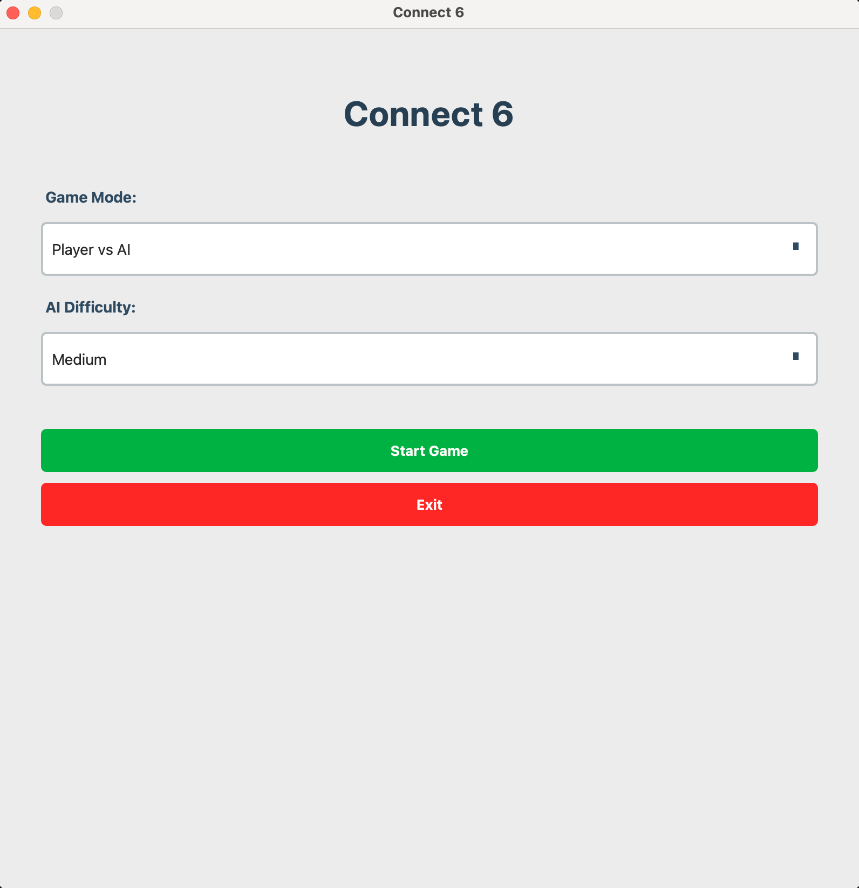
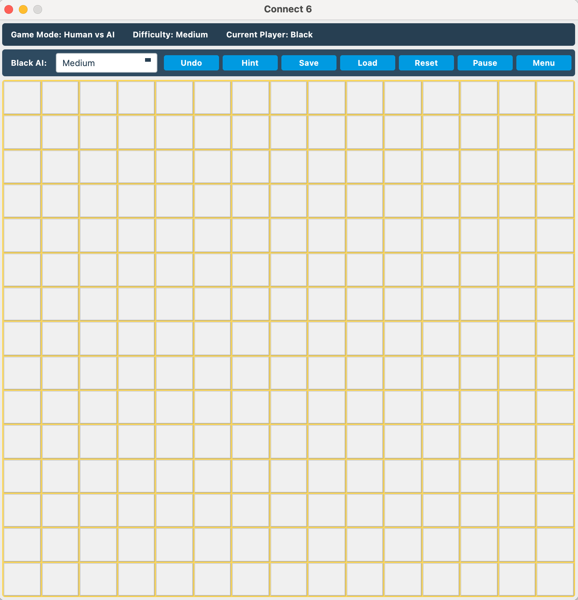
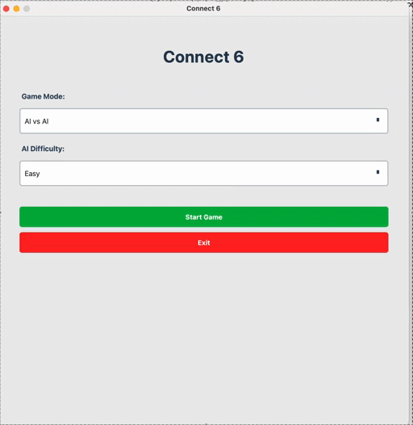

# Connect 6 Game

A modern implementation of the Connect 6 game with an advanced AI opponent using the Minimax algorithm with Alpha-Beta pruning.

## Table of Contents
- [Connect 6 Game](#connect-6-game)
  - [Table of Contents](#table-of-contents)
  - [Features](#features)
  - [Screenshots](#screenshots)
    - [Main Menu](#main-menu)
    - [Game Menu](#game-menu)
    - [Gameplay](#gameplay)
  - [Installation](#installation)
    - [Prerequisites](#prerequisites)
    - [Building from Source](#building-from-source)
    - [Building on Different Platforms](#building-on-different-platforms)
      - [Windows](#windows)
      - [macOS](#macos)
      - [Linux](#linux)
  - [Game Rules](#game-rules)
    - [Key Rules](#key-rules)
  - [AI Implementation](#ai-implementation)
  - [Project Structure](#project-structure)
  - [Development](#development)
    - [Setting Up Development Environment](#setting-up-development-environment)
    - [Running Tests](#running-tests)
  - [Contributing](#contributing)
    - [Development Workflow](#development-workflow)
    - [Code Style](#code-style)
  - [License](#license)
  - [Acknowledgments](#acknowledgments)

## Features

- 🎮 Multiple game modes:
  - Player vs Player
  - Player vs AI
  - AI vs AI
- 🤖 AI with three difficulty levels:
  - Easy (1-ply search)
  - Medium (3-ply search)
  - Hard (5-ply search)
- 🎯 Advanced AI using Minimax with Alpha-Beta pruning
- 💾 Save/Load game functionality
- 🎨 Modern UI with animations
- 📱 Cross-platform support
- 🔍 Detailed game statistics and analysis
- 🎯 Customizable board size (default 15x15)
- 💾 Game replay functionality

## Screenshots

### Main Menu


### Game Menu


### Gameplay


## Installation

### Prerequisites
- Qt 6.0 or higher
- C++17 compatible compiler
- CMake 3.15 or higher

### Building from Source

```bash
# Clone the repository
git clone git@github.com:impelixx/connect_6.git
cd connect6

# Create and enter build directory
mkdir build && cd build

# Configure and build
cmake ..
make


./connect6
```

### Building on Different Platforms

#### Windows
```bash
cmake -G "Visual Studio 17 2022" ..
cmake --build . --config Release
```

#### macOS
```bash
cmake -G "Xcode" ..
cmake --build . --config Release
```

#### Linux
```bash
cmake -G "Unix Makefiles" ..
make
```

## Game Rules

Connect 6 is a two-player game played on a 15x15 board. Players take turns placing their pieces (black and white) on the board. The first player to create a line of 6 or more pieces in any direction (horizontal, vertical, or diagonal) wins the game.

### Key Rules
1. Players alternate turns placing one piece per turn
2. Black moves first
3. A win is achieved by creating a line of 6 or more pieces
4. Lines can be horizontal, vertical, or diagonal
5. The game ends in a draw if the board is filled without a winner

## AI Implementation

The game features an advanced AI opponent that uses:
- Minimax algorithm with Alpha-Beta pruning
- Pattern recognition for move evaluation
- Center control strategy
- Move ordering optimization

For detailed information about the AI implementation, see [Algorithm Documentation](docs/ALGORITHM.md).

## Project Structure

```
connect6/
├── src/                    # Source code
│   ├── ai/                # AI implementation
│   ├── gui/               # User interface
│   ├── core/              # Game logic
│   └── utils/             # Utility functions
├── include/               # Header files
├── tests/                 # Unit tests
├── docs/                  # Documentation
├── resources/             # Game resources
└── build/                 # Build directory
```

## Development

### Setting Up Development Environment

1. Install required dependencies:
   ```bash
   # Ubuntu/Debian
   sudo apt-get install qt6-base-dev cmake build-essential

   # macOS
   brew install qt@6 cmake

   # Windows
   # Install Qt 6 and Visual Studio
   ```

2. Configure development tools:
   ```bash
   # Enable debug build
   cmake -DCMAKE_BUILD_TYPE=Debug ..
   ```

### Running Tests
```bash
cd build
ctest --output-on-failure
```

## Contributing

Contributions are welcome! Please feel free to submit a Pull Request. For major changes, please open an issue first to discuss what you would like to change.

### Development Workflow
1. Fork the repository
2. Create a feature branch (`git checkout -b feature/amazing-feature`)
3. Commit your changes (`git commit -m 'Add amazing feature'`)
4. Push to the branch (`git push origin feature/amazing-feature`)
5. Open a Pull Request

### Code Style
- Follow the [Google C++ Style Guide](https://google.github.io/styleguide/cppguide.html)
- Use meaningful variable and function names
- Add comments for complex logic
- Write unit tests for new features

## License

This project is licensed under the MIT License - see the [LICENSE](LICENSE) file for details.

## Acknowledgments

- Qt Framework for the GUI
- Modern C++ features for performance optimization
- Alpha-Beta pruning algorithm for AI optimization
- Contributors and maintainers of the project